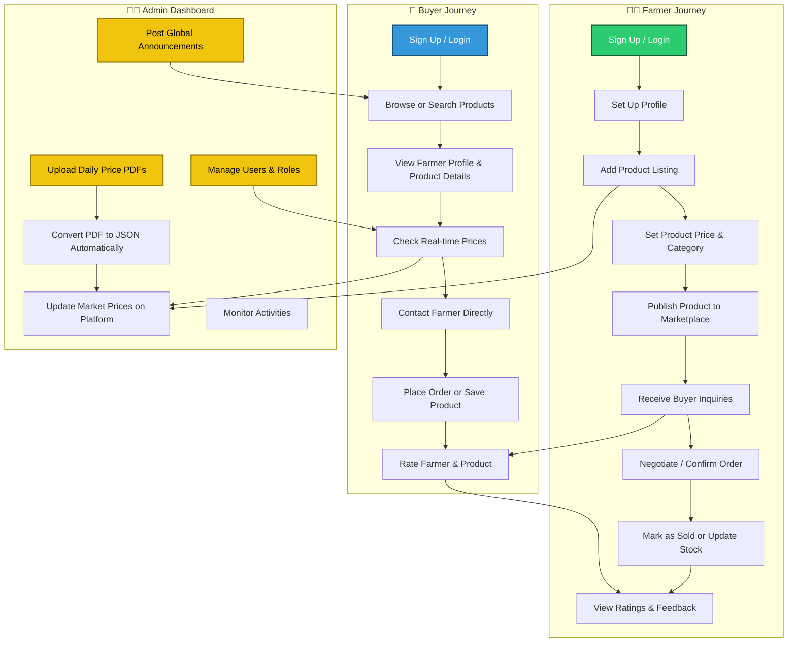
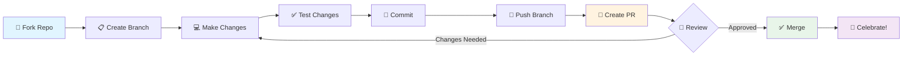

<div align="center">


### Bridging the gap between farmers and buyers through modern agricultural commerce

[](https://reactjs.org/)
[](https://vitejs.dev/)
[](https://tailwindcss.com/)
[](https://supabase.com/)

[](https://opensource.org/licenses/MIT)
[](CONTRIBUTING.md)
[](http://makeapullrequest.com)

[🚀 Live Demo](https://anisave.demo) • [📖 Documentation](https://docs.anisave.com) • [🐛 Report Bug](https://github.com/anisave/anisave/issues) • [💡 Request Feature](https://github.com/anisave/anisave/issues)

</div>

---

## 🎯 About AniSave

AniSave is a cutting-edge agricultural marketplace that revolutionizes how farmers connect with buyers. Our platform eliminates intermediaries, ensures fair pricing, and promotes sustainable farming practices while building stronger local food systems.

### 🌟 Why AniSave?

<table>
<tr>
<td align="center" width="25%">

<br><b>Direct Trade</b>
<br>Connect farmers directly with buyers, eliminating unnecessary middlemen
</td>
<td align="center" width="25%">

<br><b>Fair Pricing</b>
<br>Real-time market data ensures transparent pricing
</td>
<td align="center" width="25%">

<br><b>Community</b>
<br>Foster relationships between producers and consumers
</td>
<td align="center" width="25%">

<br><b>Sustainability</b>
<br>Promote eco-friendly farming practices
</td>
</tr>
</table>

---

## 🔄 Platform Workflow



---

## ✨ Key Features

<table>
<tr>
<td width="50%">

### 🔐 **Authentication & Security**
- 🛡️ Secure authentication with Supabase
- 👥 Role-based access (Farmers & Buyers)
- 🔒 Protected routes and data privacy
- ✅ Email verification system

### 📊 **Market Intelligence**
- 📈 Real-time price monitoring
- 📉 Market trend analysis
- 💹 Competitive pricing insights
- 📱 Price alerts and notifications

### 🛍️ **Product Management**
- ✏️ Intuitive listing interface
- 🖼️ Rich media support
- 📦 Inventory tracking
- 🏷️ Smart categorization

</td>
<td width="50%">

### 👥 **User Experience**
- 🎨 Customizable profiles
- 🔍 Advanced search & filters
- 📱 Mobile-responsive design
- 🌐 Multi-language support

### ⭐ **Trust & Safety**
- ⭐ Verified ratings system
- ✅ Seller verification
- 🔐 Secure transactions
- 🛡️ Fraud protection

### 🤝 **Networking**
- ❤️ Save favorite sellers
- 💬 Direct messaging
- 👥 Community forums
- 📧 Email notifications

</td>
</tr>
</table>

---

## 🛠️ Tech Stack

<div align="center">

### Frontend Architecture
[](https://reactjs.org/)
[](https://vitejs.dev/)
[](https://tailwindcss.com/)
[](https://reactrouter.com/)

### Backend & Database
[](https://supabase.com/)
[](https://postgresql.org/)
[](https://supabase.com/auth)
[](https://supabase.com/storage)

### Deployment & Tools
[](https://vercel.com/)
[](https://eslint.org/)
[](https://git-scm.com/)

</div>

---

## 📁 Project Structure

```
ANISAVE2.0/
├── 📁 client/
│   └── 📁 public/
│       └── 🖼️ images/
├── 📁 src/
│   ├── 🧩 components/      # Reusable UI components
│   ├── 🎯 contexts/        # React Context providers
│   ├── 📊 data/            # Static data and constants
│   ├── 🪝 hooks/           # Custom React hooks
│   ├── 📚 lib/             # Utility functions & configs
│   ├── 📄 pages/           # Page components
│   ├── 🎨 App.css          # Global styles
│   ├── ⚛️ App.jsx          # Main App component
│   ├── 🎨 index.css        # Base styles
│   ├── 🚀 main.jsx         # App entry point
│   └── 🛣️ Routes.jsx       # Route definitions
├── ⚙️ .env                 # Environment variables
├── 🚫 .gitignore           # Git ignore rules
├── 📋 eslint.config.js     # ESLint configuration
├── 🌐 index.html           # HTML entry point
├── 📦 package.json         # Dependencies
├── 🎨 postcss.config.js    # PostCSS configuration
├── 📖 README.md            # This file
├── 🎨 tailwind.config.js   # Tailwind configuration
└── ⚡ vite.config.js       # Vite configuration
```

---

## 🚀 Getting Started

### Prerequisites

<table>
<tr>
<td align="center" width="33%">

<br><b>Node.js v18+</b>
</td>
<td align="center" width="33%">

<br><b>npm or yarn</b>
</td>
<td align="center" width="33%">

<br><b>Git</b>
</td>
</tr>
</table>

### 🎬 Quick Start

```bash
# 1️⃣ Clone the repository
git clone https://github.com/anisave/anisave.git
cd anisave

# 2️⃣ Install dependencies
npm install

# 3️⃣ Set up environment variables
cp .env.example .env.local
# Edit .env.local with your Supabase credentials

# 4️⃣ Run the development server
npm run dev

# 5️⃣ Open your browser
# Navigate to http://localhost:5173
```

### 🔑 Environment Variables

```env
# Supabase Configuration
VITE_SUPABASE_URL=your_supabase_project_url
VITE_SUPABASE_ANON_KEY=your_supabase_anon_key

# Optional: Additional Configuration
VITE_APP_NAME=AniSave
VITE_API_ENDPOINT=your_api_endpoint
```

> 💡 **Pro Tip**: Get your Supabase credentials from your [Supabase Dashboard](https://app.supabase.com/)

---

## 📋 Available Scripts

| Command | Description | When to Use |
|---------|-------------|-------------|
| `npm run dev` | 🚀 Start development server | Daily development |
| `npm run build` | 🏗️ Build for production | Before deployment |
| `npm run preview` | 👀 Preview production build | Test production locally |
| `npm run lint` | 🔍 Run ESLint | Check code quality |
| `npm run lint:fix` | 🔧 Fix ESLint errors | Auto-fix issues |
| `npm test` | 🧪 Run test suite | Before committing |

---

## 🤝 Contributing

We love contributions! Here's how you can help make AniSave better:

### 📝 Contribution Workflow



### 🔧 Step-by-Step Guide

1. **🍴 Fork the repository**
2. **📋 Create a feature branch**
   ```bash
   git checkout -b feature/amazing-feature
   ```
3. **💻 Commit your changes**
   ```bash
   git commit -m '✨ Add some amazing feature'
   ```
4. **🚀 Push to the branch**
   ```bash
   git push origin feature/amazing-feature
   ```
5. **🔄 Open a Pull Request**

### 📜 Guidelines

- 📖 Read our [Contributing Guidelines](CONTRIBUTING.md)
- 🤝 Follow our [Code of Conduct](CODE_OF_CONDUCT.md)
- ✍️ Use [conventional commits](https://www.conventionalcommits.org/)
- ✅ Ensure all tests pass before submitting

---

## 📖 Documentation

<div align="center">

| Resource | Description |
|----------|-------------|
| [📚 Full Documentation](https://docs.anisave.com) | Complete platform guide |
| [🎯 API Reference](https://docs.anisave.com/api) | API endpoints and usage |
| [🎨 Design System](https://docs.anisave.com/design) | UI components and patterns |
| [🚀 Deployment Guide](https://docs.anisave.com/deployment) | Hosting and deployment |
| [🔧 Troubleshooting](https://docs.anisave.com/troubleshooting) | Common issues and fixes |

</div>

---

## 🛟 Issues & Support

<table>
<tr>
<td align="center" width="25%">
<a href="https://github.com/anisave/anisave/issues/new?template=bug_report.md">

<br><b>Report Bug</b>
</a>
</td>
<td align="center" width="25%">
<a href="https://github.com/anisave/anisave/issues/new?template=feature_request.md">

<br><b>Request Feature</b>
</a>
</td>
<td align="center" width="25%">
<a href="https://discord.gg/anisave">

<br><b>Join Discord</b>
</a>
</td>
<td align="center" width="25%">
<a href="mailto:support@anisave.com">

<br><b>Email Support</b>
</a>
</td>
</tr>
</table>

---

## 🎯 Roadmap

<details>
<summary><b>🚀 Version 2.1 (Q1 2025)</b></summary>

- [ ] 📱 Mobile app (iOS & Android)
- [ ] 💬 Real-time chat system
- [ ] 📊 Advanced analytics dashboard
- [ ] 🌍 Multi-language support
- [ ] 🔔 Push notifications

</details>

<details>
<summary><b>✨ Version 2.2 (Q2 2025)</b></summary>

- [ ] 🤖 AI-powered price recommendations
- [ ] 📸 Image recognition for produce quality
- [ ] 🚚 Integrated logistics tracking
- [ ] 💳 Multiple payment gateways
- [ ] 🎁 Loyalty rewards program

</details>

<details>
<summary><b>🌟 Version 3.0 (Q3 2025)</b></summary>

- [ ] 🌐 Blockchain integration for transparency
- [ ] 🎮 Gamification features
- [ ] 📈 Predictive market analytics
- [ ] 🤝 B2B marketplace
- [ ] 🌱 Carbon footprint tracking

</details>

---

## 📊 Project Stats

<div align="center">


</div>

---

## 📜 License

This project is licensed under the **MIT License**. See the [LICENSE](LICENSE) file for details.

```
MIT License - feel free to use this project for personal or commercial purposes
```

---

## 🙏 Acknowledgments

<table>
<tr>
<td align="center">

<br><b>Contributors</b>
<br>Thanks to all who helped!
</td>
<td align="center">

<br><b>Open Source</b>
<br>Built with amazing tools
</td>
<td align="center">

<br><b>Farmers</b>
<br>Our inspiration
</td>
<td align="center">

<br><b>Community</b>
<br>Supporting sustainability
</td>
</tr>
</table>

---

<div align="center">

## 💚 Made with Love

**Empowering farmers, connecting communities, building sustainable food systems.**

[](https://github.com/anisave/anisave)
[](https://twitter.com/anisave)
[](https://linkedin.com/company/anisave)

---

### 🌟 Star us on GitHub — it motivates us a lot!

[⬆ Back to Top](#-anisave)

---

*Built with ❤️ by the AniSave Team | © 2025 AniSave. All rights reserved.*

</div>